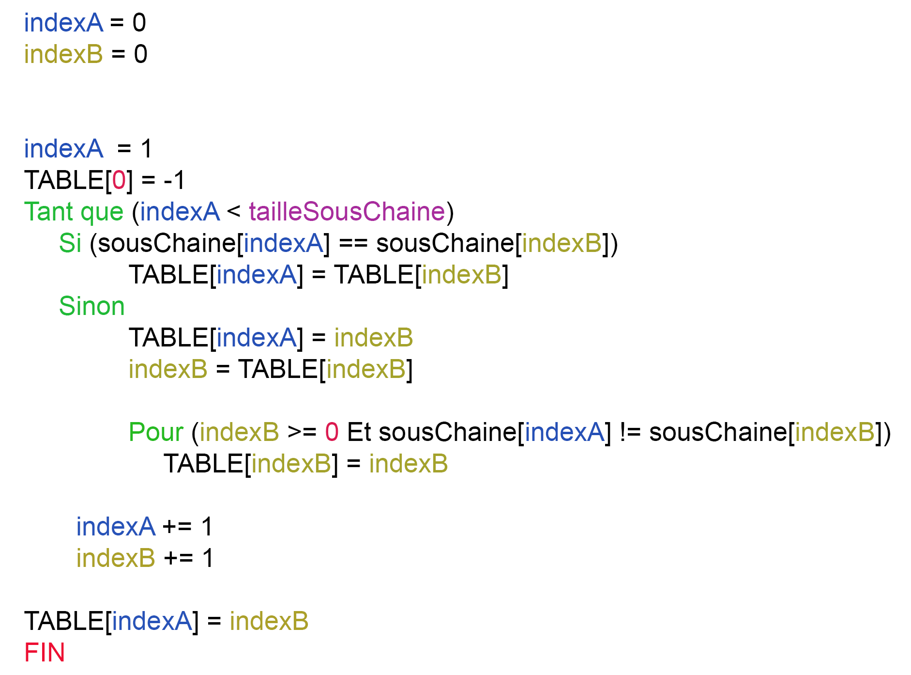
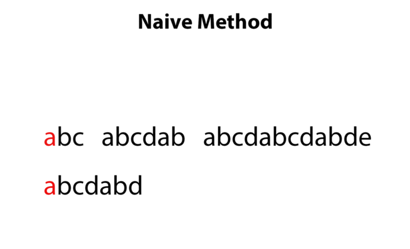
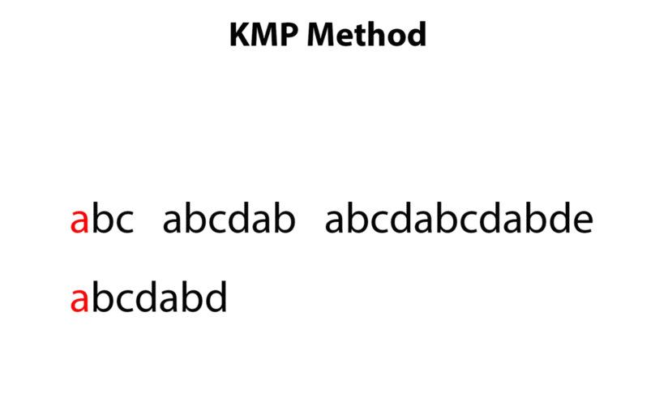
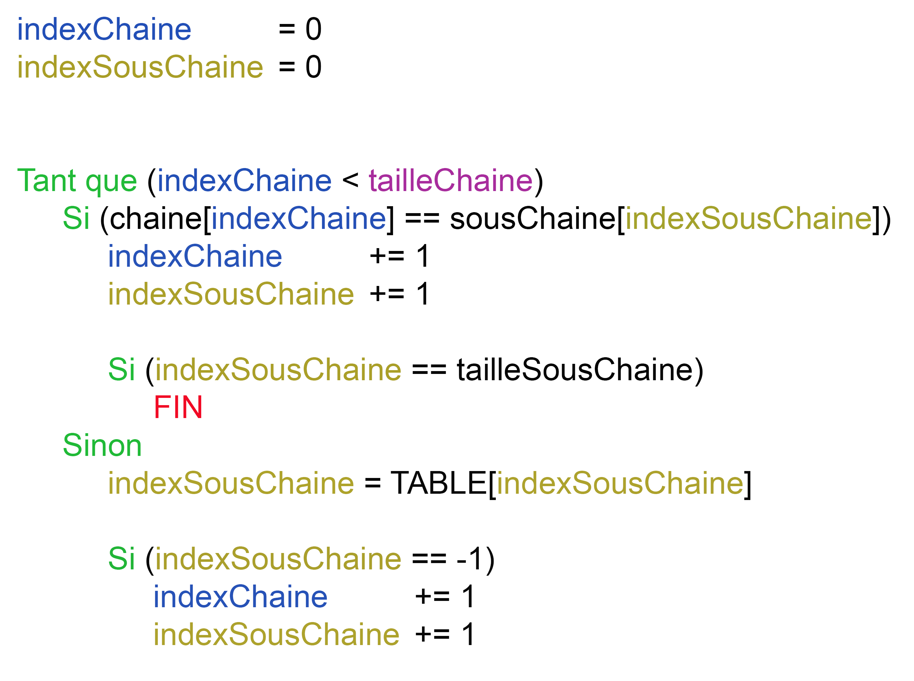

## Contribution
You can contribute to the improvement of the documentation, by adding, modifying or deleting items.

## Explanation
[The Knuth-Morris-Pratt algorithm](https://en.wikipedia.org/wiki/Knuth%E2%80%93Morris%E2%80%93Pratt_algorithm) is a [String-searching algorithm](https://en.wikipedia.org/wiki/String-searching_algorithm).

It does a pre-processing on the substring by creating a table with the jumps to do to avoid unnecessary research.

The algorithm is divided into 2 parts, a phase of construction of the jump table and a research phase.

## Building of the jump table [[Table code](../kmp/table.go)]
For "participate in parachute" (24), the table is `-1 0 0 0 0 0 0 -1 0 2 0 0 0 0 0 -1 0 0 3 0 0 0 0 0 0 (25)`

The first letter is "p", so for each "p", we write `-1` in the table.

The second letter is "a", so for each "pa", we write `-1 0` in the table.

The second letter is "r", so for each "par", we write `-1 0 0` in the table.

...

Put `0` for each match finished by the length or the first combination as:
* `-1 0 0 0 0 0 0 -1` == `particip` (first combination `partici`)
* `-1 0 0 0 0 0 0 -1 0 2` == `participat` (the `2` means both before the `t`)

For `par`, we write `-1 0 0 0`, if the next one is `t` then `-1 0 0 0` otherwise `-1 0 0 3` (except the beginning of course)

So:
* `-1 0 0 0 0 0 0` == `partici`
* `-1 0 2` == `pat`
* `0 0 0 0 0` == `e in `
* `-1 0 0 3` == `para`
* `0 0 0 0 0` == `chute`
* `0` the last character serves a registered combination if there is one at the end, so the table makes the size of the substring + 1

#### Pseudo code

## Search for the substring [[Search Code](../kmp/search.go)]
The search is very simple, when it is equal, the index of the string and the index of the substring are incremented.

When it is not equal, the value of the Table is retrieved with the index of the substring, this value becomes the index of the substring.

If the index of the substring is `-1`, the 2 indexes are incremented or nothing is done.

With the naive method, we are at 39 steps.

With the KMP method, we are at 26 steps.

#### Pseudo code

